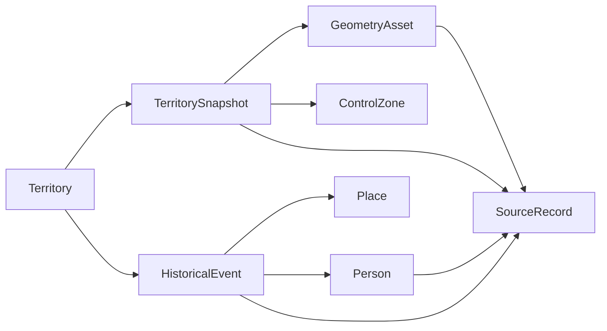

# Global History Data Model

This document defines a region-agnostic data model for a commercial history atlas product.
It is designed to support China first, but also Europe, the Middle East, India, Africa,
the Americas, and cross-regional empires without redesigning the storage model.

## Design Goals

- Work for both dynasties and nation-states
- Support multiple historical periods in one product
- Separate political entities from geometry snapshots
- Track historical uncertainty and contested boundaries
- Keep source provenance and license traceability on every shipped asset
- Support points, polygons, and narrative content in the same system

## Core Principles

### 1. Separate "entity" from "shape"

A territory like `western_han` or `roman_empire` is not the same thing as its geometry in a
particular year. The entity should stay stable while snapshots change over time.

### 2. Use time ranges, not just single years

The current MVP uses representative years. The global model should support:

- exact years
- year ranges
- approximate dates
- open-ended validity

### 3. Model control strength explicitly

Historical boundaries are often not binary. A region may be:

- core directly governed territory
- administered frontier
- tributary sphere
- claimed but disputed region
- temporary occupation zone

This should be represented in data, not only described in text.

### 4. Make sources first-class

Every boundary and every important factual record should map back to a source record and a review
status, so global expansion does not create legal or provenance debt.

## Entity Overview

## Recommended Top-Level Files

- `project_scope.json`
- `territories.json`
- `territory_snapshots.json`
- `events.json`
- `people.json`
- `places.json`
- `sources.json`
- `geometry_manifest.json`

Optional later:

- `organizations.json`
- `trade_routes.json`
- `religions.json`
- `languages.json`

## Global Map + Story Driven Architecture

To prevent becoming just another "color-filled world map encyclopedia" like GeaCron or TimeMaps, this model combines **Global Territories (Base Layer)** with **Storylines (Narrative Layer)**. 

1. **Global Territories**: Using the `Territory` and `TerritorySnapshot` entities, we can import world history datasets (e.g., Roman Empire, Parthian Empire) alongside Chinese dynasties. Control zones (`core_admin`, `vassal`, etc.) will show varying degrees of political control.
2. **Storylines**: Using the `Storyline` entity, we thread isolated events across different countries and regions into a cohesive narrative (e.g., "The Silk Road", "World War II"). This allows the user to click through a story while the map automatically updates years, shifts focus, and draws global boundaries dynamically.

## Canonical Models

### 1. `Territory`

Represents a persistent political or civilizational entity.

Use for:

- dynasties
- kingdoms
- empires
- republics
- colonial administrations
- dependent states
- confederations

Recommended fields:

- `id`
- `slug`
- `names`
- `territoryType`
- `parentCivilizationId`
- `start`
- `end`
- `capitalPlaceIds`
- `predecessorIds`
- `successorIds`
- `summary`
- `summaryLong`
- `governanceHighlights`
- `legacy`
- `tags`
- `sourceRefs`

Notes:

- `names` should be multilingual and alias-friendly
- `territoryType` should not be China-specific; examples:
  - `dynasty`
  - `empire`
  - `kingdom`
  - `republic`
  - `state`
  - `confederation`
  - `colony`

### 2. `TerritorySnapshot`

Represents one temporal view of a territory.

Recommended fields:

- `id`
- `territoryId`
- `validFrom`
- `validTo`
- `displayYear`
- `geometryRefs`
- `controlZones`
- `mapFocus`
- `headline`
- `territoryNote`
- `boundaryHighlights`
- `accuracy`
- `disputeNotes`
- `sourceRefs`
- `reviewStatus`
- `highlightedEventIds`

This is the main unit used by the UI timeline.

### 3. `GeometryAsset`

Represents a shapefile or GeoJSON-derived file used for map rendering.

Recommended fields:

- `id`
- `assetPath`
- `geometryType`
- `regionScope`
- `simplificationLevel`
- `licenseSourceId`
- `derivedFromSourceIds`
- `projection`
- `bbox`
- `revision`
- `editorNotes`

Important:

- store geometry metadata separately from the territory snapshot
- a snapshot may reference multiple geometry assets

### 4. `ControlZone`

Represents different types of historical control inside one snapshot.

Recommended fields:

- `id`
- `snapshotId`
- `zoneType`
- `geometryRef`
- `label`
- `description`
- `displayStyle`
- `confidence`
- `sourceRefs`

Recommended `zoneType` values:

- `core_admin`
- `frontier_admin`
- `tributary`
- `vassal`
- `claimed`
- `occupied`
- `disputed`
- `sphere_of_influence`

This is the main upgrade that makes the model global instead of simplistic.

### 5. `HistoricalEvent`

Represents an event that happened at a point in time or over a time range.

Recommended fields:

- `id`
- `title`
- `displayTitle`
- `start`
- `end`
- `datePrecision`
- `territoryIds`
- `placeIds`
- `lat`
- `lng`
- `summary`
- `content`
- `significance`
- `consequences`
- `tags`
- `relatedPersonIds`
- `relatedTerritoryIds`
- `sourceRefs`
- `confidence`

The global version should not assume one event belongs to exactly one state.

### 6. `Person`

Represents an individual connected to territories and events.

Recommended fields:

- `id`
- `names`
- `birth`
- `death`
- `activeRange`
- `roles`
- `bioShort`
- `bioLong`
- `contribution`
- `relatedTerritoryIds`
- `relatedEventIds`
- `birthPlaceId`
- `deathPlaceId`
- `sourceRefs`

### 7. `Place`

Represents a reusable place entity independent of event cards.

Recommended fields:

- `id`
- `names`
- `placeType`
- `modernCountryCode`
- `lat`
- `lng`
- `parentPlaceId`
- `aliases`
- `wikidataId`
- `geonamesId`
- `sourceRefs`

Use this to avoid storing raw place strings repeatedly in events.

### 8. `SourceRecord`

Represents provenance, licensing, and review details.

Recommended fields:

- `id`
- `sourceName`
- `sourceType`
- `sourceUrl`
- `licenseName`
- `licenseUrl`
- `commercialUseAllowed`
- `redistributionAllowed`
- `modificationAllowed`
- `attributionRequired`
- `attributionText`
- `approvalStatus`
- `reviewDate`
- `reviewOwner`
- `notes`

This should align with the license ledger introduced under `docs/data-governance/`.

### 9. `Storyline`

Represents a narrative thread that strings together events across different times and regions (e.g., "The Silk Road", "Age of Discovery"). This gives the global map a "story mode" beyond just scrolling the timeline.

Recommended fields:

- `id`
- `titleZh` / `titleEn`
- `emoji`
- `themeType` (e.g., "trade", "military", "culture")
- `descriptionZh` / `descriptionEn`
- `eventIds` (Ordered list of `HistoricalEvent` IDs)
- `narrativeIntro` (Object containing text and a `coreQuestion`)

## Time Model

Use structured dates instead of raw integers where possible.

Recommended date object:

- `year`
- `month`
- `day`
- `approximate`
- `calendar`
- `displayLabel`

For many historical products, the minimum viable layer can still store:

- `startYear`
- `endYear`
- `datePrecision`

Recommended `datePrecision` values:

- `exact_year`
- `approximate_year`
- `year_range`
- `century`
- `unknown`

## Naming Model

Do not hardcode only `nameZh` and `nameEn` long term.

Use:

- `primaryName`
- `localizedNames`
- `aliases`
- `transliterations`

Example:

- `localizedNames.zh-Hans`
- `localizedNames.en`
- `localizedNames.ar`
- `localizedNames.fr`

This matters once the product leaves China-only content.

## Suggested Global JSON Conventions

### IDs

- lowercase snake_case or kebab-case
- stable and semantic, e.g. `western_han`, `roman_empire`, `mughal_empire`

### Source refs

Always use source IDs rather than inline source text:

- good: `"sourceRefs": ["ohm_world_polities", "editorial_qin_han_v1"]`
- bad: `"sourceNotes": ["from a map on the web"]`

### Geometry refs

Snapshots should reference geometry by ID, not by raw path only:

- good: `"geometryRefs": ["qin_-221_main_v5"]`
- bad: `"geoJsonAsset": "assets/geojson/qin_-221.geojson"`

## Migration Path From Current MVP

Current MVP model:

- `Territory`
- `TerritorySnapshot`
- `HistoricalEvent`
- `HistoricalPerson`

Recommended next-step upgrades:

1. introduce `Place`
2. introduce `SourceRecord`
3. replace single `geoJsonAsset` with `geometryRefs`
4. add `ControlZone`
5. convert `nameZh/nameEn` to localized naming object over time
6. add `validFrom/validTo` for snapshots

## Practical Rule For Future Expansion

Before adding a new region, make sure all imported data can answer these questions:

1. What entity is this?
2. During what period is it valid?
3. Which geometry file renders it?
4. What kind of control does the geometry represent?
5. What source and license justify the data?
6. What events, people, and places link to it?

If a new dataset cannot answer these questions, it should not define the product model.
